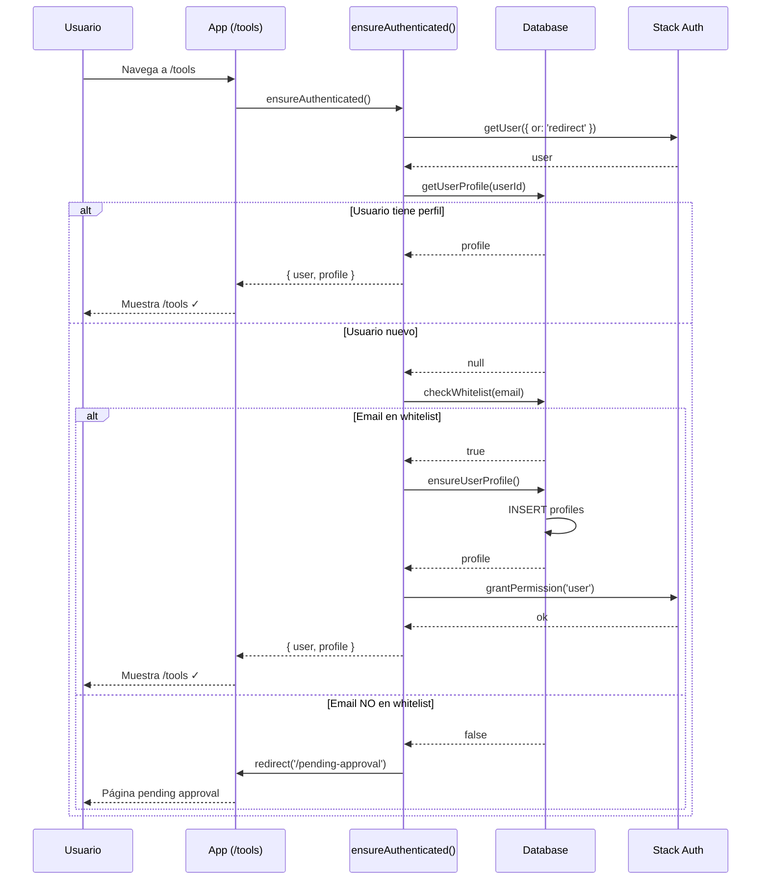

# Plan Detallado: Sistema Multi-Tenant Simplificado con RLS

## Fecha: 2025-09-30
## Estado: En Implementación
## Objetivo: Implementar multi-tenancy con RLS sin sistema complejo de invitaciones

---

## 📋 Resumen Ejecutivo

### Problema Actual
El sistema actual usa whitelist/blacklist que NO es multi-tenant:
- Los usuarios en whitelist van directo a `/pending-approval` (error 403)
- No hay concepto de organización (tenant)
- No hay aislamiento de datos entre diferentes empresas
- La base de datos tiene campos `tenant_id` pero NO se usan

### Solución Simplificada
1. **Un tenant único por ahora**: Todos los usuarios whitelist → misma organización
2. **RLS estricto**: Políticas de seguridad a nivel de base de datos
3. **Sin sistema de invitaciones todavía**: Eso se implementará después

### Por qué esta aproximación
- ✅ Soluciona el problema inmediato del error 403
- ✅ Implementa seguridad multi-tenant desde ahora
- ✅ Permite migración gradual a multi-org en el futuro
- ✅ No requiere rediseñar toda la UI de onboarding

---

## 🏗️ Arquitectura de la Solución

### Estructura de Datos

```
┌─────────────────────────────────────────────┐
│         neon_auth.users_sync                │
│  (Stack Auth - Gestión de usuarios)         │
└──────────────────┬──────────────────────────┘
                   │
                   │ userId (FK)
                   ▼
┌─────────────────────────────────────────────┐
│              profiles                        │
│  ┌─────────────────────────────────┐        │
│  │ userId: text (PK)               │        │
│  │ companyId: uuid (FK)            │ ◄──────┼─────┐
│  │ tenantId: uuid (RLS!)           │        │     │
│  │ roleType: enum                  │        │     │
│  │ department: varchar             │        │     │
│  │ areaId: uuid (opcional)         │        │     │
│  └─────────────────────────────────┘        │     │
└─────────────────────────────────────────────┘     │
                                                     │
                                                     │
┌────────────────────────────────────────────────────┘
│
│           ┌─────────────────────────────────────────────┐
│           │              companies                       │
│           │  ┌─────────────────────────────────┐        │
└───────────┼──┤ id: uuid (PK)                   │        │
            │  │ name: varchar                   │        │
            │  │ description: text               │        │
            │  │ industry: varchar               │        │
            │  │ DEFAULT_ORG_ID por ahora        │        │
            │  └─────────────────────────────────┘        │
            └─────────────────────────────────────────────┘

                   ┌──────────────────┐
                   │   objectives     │ ◄─── tenantId (RLS)
                   └──────────────────┘

                   ┌──────────────────┐
                   │   initiatives    │ ◄─── tenantId (RLS)
                   └──────────────────┘

                   ┌──────────────────┐
                   │   activities     │ ◄─── tenantId (RLS)
                   └──────────────────┘

                   ┌──────────────────┐
                   │   key_results    │ ◄─── tenantId (RLS)
                   └──────────────────┘
```

### Flujo de Autenticación Simplificado

```
Usuario hace Sign In/Sign Up
         │
         ▼
Stack Auth valida
         │
         ▼
  ¿Usuario tiene perfil?
         │
    ┌────┴────┐
    │         │
   NO        YES
    │         │
    │         └──► Verificar membresía → /tools ✓
    │
    ▼
¿Email en whitelist?
    │
┌───┴───┐
│       │
NO     YES
│       │
│       └──► Crear perfil en DEFAULT_ORG → /tools ✓
│
└──► /pending-approval (mantener para casos edge)
```

---

## 📝 Implementación Detallada

### Fase 1: Configuración de Organización por Defecto

#### Archivo: `/lib/organization/simple-tenant.ts`

**Propósito**: Gestión simple de tenant único.

**Funciones principales**:

1. **`ensureDefaultOrganization()`**
   ```typescript
   // Crea la organización por defecto si no existe
   // ID fijo: 00000000-0000-0000-0000-000000000001
   // Nombre: "StratixV2 Organization"
   ```

2. **`ensureUserProfile(userId, userEmail, fullName?)`**
   ```typescript
   // Crea perfil de usuario en DEFAULT_ORG
   // Role: 'corporativo' (todos por ahora)
   // Department: 'General'
   // tenantId = companyId = DEFAULT_ORG_ID
   ```

3. **`hasOrganizationAccess(userId, orgId)`**
   ```typescript
   // Verifica si usuario pertenece a organización
   // Por ahora siempre verifica DEFAULT_ORG_ID
   ```

4. **`getUserProfile(userId)`**
   ```typescript
   // Obtiene perfil con datos de organización
   // Incluye relación con company
   ```

---

### Fase 2: Actualización de Lógica de Autenticación

#### Archivo: `/lib/auth.ts`

**Cambios principales**:

**ANTES (Whitelist/Blacklist)**:
```typescript
export async function ensureToolPermissions() {
  const user = await stackServerApp.getUser({ or: 'redirect' });

  // Verifica permisos Stack Auth
  const [isAdmin, isUser] = await Promise.all([
    user.hasPermission('admin'),
    user.hasPermission('user'),
  ]);

  if (isAdmin || isUser) {
    return user;
  }

  // Verifica whitelist/blacklist
  const isBlacklisted = await db.query.blacklistedEmailsTable.findFirst(...);
  if (isBlacklisted) redirect('/pending-approval');

  const isDomainWhitelisted = await db.query.whitelistedDomainsTable.findFirst(...);
  if (isDomainWhitelisted) {
    await user.grantPermission('user');
    return user;
  }

  const isEmailWhitelisted = await db.query.whitelistedEmailsTable.findFirst(...);
  if (isEmailWhitelisted) {
    await user.grantPermission('user');
    return user;
  }

  redirect('/pending-approval');
}
```

**DESPUÉS (Multi-Tenant)**:
```typescript
import { ensureUserProfile, getUserProfile } from '@/lib/organization/simple-tenant';

export async function ensureAuthenticated() {
  const user = await stackServerApp.getUser({ or: 'redirect' });

  // 1. Verificar si usuario tiene perfil (pertenece a organización)
  let profile = await getUserProfile(user.id);

  if (!profile) {
    // 2. Usuario nuevo - verificar whitelist
    const isWhitelisted = await checkWhitelist(user.primaryEmail);

    if (isWhitelisted) {
      // 3. Crear perfil en DEFAULT_ORG
      profile = await ensureUserProfile(
        user.id,
        user.primaryEmail,
        user.displayName
      );

      // 4. Otorgar permiso 'user' en Stack Auth
      await user.grantPermission('user');
    } else {
      // 5. No whitelisted → pending approval
      redirect('/pending-approval');
    }
  }

  // 6. Usuario tiene perfil → continuar
  return { user, profile };
}

// Helper: verifica whitelist (mantiene lógica existente)
async function checkWhitelist(email: string): Promise<boolean> {
  // Verifica blacklist primero
  const isBlacklisted = await db.query.blacklistedEmailsTable.findFirst({
    where: eq(blacklistedEmailsTable.email, email),
  });

  if (isBlacklisted) return false;

  // Verifica dominio whitelisted
  const domain = email.split('@')[1];
  if (domain) {
    const isDomainWhitelisted = await db.query.whitelistedDomainsTable.findFirst({
      where: eq(whitelistedDomainsTable.domain, domain),
    });

    if (isDomainWhitelisted) return true;
  }

  // Verifica email específico whitelisted
  const isEmailWhitelisted = await db.query.whitelistedEmailsTable.findFirst({
    where: eq(whitelistedEmailsTable.email, email),
  });

  return Boolean(isEmailWhitelisted);
}

// Mantener función antigua para compatibilidad (wrapper)
export async function ensureToolPermissions() {
  return ensureAuthenticated();
}
```

**Ventajas del nuevo enfoque**:
- ✅ Crea perfil automáticamente para usuarios whitelist
- ✅ Asocia automáticamente con DEFAULT_ORG
- ✅ Establece `tenantId` desde el inicio
- ✅ Mantiene compatibilidad con código existente
- ✅ Preparado para expansión a multi-org

---

### Fase 3: Row Level Security (RLS) Policies

#### Archivo: `/drizzle/0005_rls_policies.sql`

**Propósito**: Asegurar que los datos de un tenant NO sean accesibles por otros tenants.

**Políticas RLS por tabla**:

#### 3.1 Enable RLS en todas las tablas

```sql
-- Habilitar RLS en todas las tablas con tenantId
ALTER TABLE profiles ENABLE ROW LEVEL SECURITY;
ALTER TABLE objectives ENABLE ROW LEVEL SECURITY;
ALTER TABLE initiatives ENABLE ROW LEVEL SECURITY;
ALTER TABLE activities ENABLE ROW LEVEL SECURITY;
ALTER TABLE key_results ENABLE ROW LEVEL SECURITY;
ALTER TABLE comments ENABLE ROW LEVEL SECURITY;
ALTER TABLE update_history ENABLE ROW LEVEL SECURITY;
```

#### 3.2 Función helper para obtener tenant_id del usuario

```sql
-- Función que retorna el tenant_id del usuario autenticado
CREATE OR REPLACE FUNCTION auth.user_tenant_id()
RETURNS uuid
LANGUAGE sql
STABLE
AS $$
  SELECT tenant_id
  FROM public.profiles
  WHERE user_id = auth.uid();
$$;
```

**Nota**: Esta función usa `auth.uid()` que debe ser provisto por Neon Auth.

#### 3.3 Policies para cada tabla

**PROFILES**:
```sql
-- SELECT: Usuario puede ver perfiles de su mismo tenant
CREATE POLICY "profiles_select_policy" ON profiles
FOR SELECT
USING (tenant_id = auth.user_tenant_id());

-- INSERT: Solo Stack Auth puede insertar (vía función serverless)
CREATE POLICY "profiles_insert_policy" ON profiles
FOR INSERT
WITH CHECK (tenant_id = auth.user_tenant_id());

-- UPDATE: Usuario puede actualizar su propio perfil
CREATE POLICY "profiles_update_policy" ON profiles
FOR UPDATE
USING (user_id = auth.uid())
WITH CHECK (tenant_id = auth.user_tenant_id());
```

**OBJECTIVES**:
```sql
-- SELECT: Solo del mismo tenant
CREATE POLICY "objectives_select_policy" ON objectives
FOR SELECT
USING (tenant_id = auth.user_tenant_id());

-- INSERT: Solo usuarios del mismo tenant
CREATE POLICY "objectives_insert_policy" ON objectives
FOR INSERT
WITH CHECK (tenant_id = auth.user_tenant_id());

-- UPDATE: Solo del mismo tenant
CREATE POLICY "objectives_update_policy" ON objectives
FOR UPDATE
USING (tenant_id = auth.user_tenant_id())
WITH CHECK (tenant_id = auth.user_tenant_id());

-- DELETE: Solo del mismo tenant
CREATE POLICY "objectives_delete_policy" ON objectives
FOR DELETE
USING (tenant_id = auth.user_tenant_id());
```

**INITIATIVES**:
```sql
CREATE POLICY "initiatives_select_policy" ON initiatives
FOR SELECT
USING (tenant_id = auth.user_tenant_id());

CREATE POLICY "initiatives_insert_policy" ON initiatives
FOR INSERT
WITH CHECK (tenant_id = auth.user_tenant_id());

CREATE POLICY "initiatives_update_policy" ON initiatives
FOR UPDATE
USING (tenant_id = auth.user_tenant_id())
WITH CHECK (tenant_id = auth.user_tenant_id());

CREATE POLICY "initiatives_delete_policy" ON initiatives
FOR DELETE
USING (tenant_id = auth.user_tenant_id());
```

**ACTIVITIES**:
```sql
CREATE POLICY "activities_select_policy" ON activities
FOR SELECT
USING (tenant_id = auth.user_tenant_id());

CREATE POLICY "activities_insert_policy" ON activities
FOR INSERT
WITH CHECK (tenant_id = auth.user_tenant_id());

CREATE POLICY "activities_update_policy" ON activities
FOR UPDATE
USING (tenant_id = auth.user_tenant_id())
WITH CHECK (tenant_id = auth.user_tenant_id());

CREATE POLICY "activities_delete_policy" ON activities
FOR DELETE
USING (tenant_id = auth.user_tenant_id());
```

**KEY_RESULTS**:
```sql
CREATE POLICY "key_results_select_policy" ON key_results
FOR SELECT
USING (tenant_id = auth.user_tenant_id());

CREATE POLICY "key_results_insert_policy" ON key_results
FOR INSERT
WITH CHECK (tenant_id = auth.user_tenant_id());

CREATE POLICY "key_results_update_policy" ON key_results
FOR UPDATE
USING (tenant_id = auth.user_tenant_id())
WITH CHECK (tenant_id = auth.user_tenant_id());

CREATE POLICY "key_results_delete_policy" ON key_results
FOR DELETE
USING (tenant_id = auth.user_tenant_id());
```

**COMMENTS**:
```sql
CREATE POLICY "comments_select_policy" ON comments
FOR SELECT
USING (tenant_id = auth.user_tenant_id());

CREATE POLICY "comments_insert_policy" ON comments
FOR INSERT
WITH CHECK (tenant_id = auth.user_tenant_id());

CREATE POLICY "comments_update_policy" ON comments
FOR UPDATE
USING (tenant_id = auth.user_tenant_id() AND author_id = auth.uid())
WITH CHECK (tenant_id = auth.user_tenant_id());

CREATE POLICY "comments_delete_policy" ON comments
FOR DELETE
USING (tenant_id = auth.user_tenant_id() AND author_id = auth.uid());
```

**UPDATE_HISTORY**:
```sql
CREATE POLICY "update_history_select_policy" ON update_history
FOR SELECT
USING (tenant_id = auth.user_tenant_id());

CREATE POLICY "update_history_insert_policy" ON update_history
FOR INSERT
WITH CHECK (tenant_id = auth.user_tenant_id());
```

---

### Fase 4: Script de Migración de Datos

#### Archivo: `/scripts/migrate-existing-data.ts`

**Propósito**: Migrar datos existentes (si los hay) al nuevo modelo multi-tenant.

```typescript
import db from '@/db';
import { companies, profiles } from '@/db/okr-schema';
import { DEFAULT_ORG_ID, DEFAULT_ORG_NAME } from '@/lib/organization/simple-tenant';

async function migrateToMultiTenant() {
  console.log('🚀 Starting multi-tenant migration...');

  // 1. Crear organización por defecto
  console.log('📦 Creating default organization...');
  await db.insert(companies)
    .values({
      id: DEFAULT_ORG_ID,
      name: DEFAULT_ORG_NAME,
      description: 'Default organization for all users',
      industry: 'General',
      size: 'Medium',
    })
    .onConflictDoNothing();

  // 2. Obtener todos los usuarios de neon_auth.users_sync
  console.log('👥 Fetching existing users...');
  const users = await db.query.usersSyncInNeonAuth.findMany();

  console.log(`Found ${users.length} users`);

  // 3. Crear perfil para cada usuario que no lo tenga
  for (const user of users) {
    const existingProfile = await db.query.profiles.findFirst({
      where: eq(profiles.userId, user.id),
    });

    if (!existingProfile) {
      console.log(`  ➕ Creating profile for user: ${user.primaryEmail}`);

      await db.insert(profiles).values({
        userId: user.id,
        fullName: user.displayName || user.primaryEmail.split('@')[0],
        roleType: 'corporativo',
        department: 'General',
        companyId: DEFAULT_ORG_ID,
        tenantId: DEFAULT_ORG_ID,
      });
    } else {
      console.log(`  ✓ Profile exists for user: ${user.primaryEmail}`);
    }
  }

  // 4. Actualizar registros existentes con tenantId
  console.log('🔄 Updating tenant_id for existing records...');

  // Objectives
  const objectives = await db.query.objectives.findMany();
  for (const obj of objectives) {
    if (!obj.tenantId) {
      await db.update(objectives)
        .set({ tenantId: DEFAULT_ORG_ID })
        .where(eq(objectives.id, obj.id));
    }
  }

  // Initiatives
  const initiatives = await db.query.initiatives.findMany();
  for (const init of initiatives) {
    if (!init.tenantId) {
      await db.update(initiatives)
        .set({ tenantId: DEFAULT_ORG_ID })
        .where(eq(initiatives.id, init.id));
    }
  }

  // Activities
  const activities = await db.query.activities.findMany();
  for (const act of activities) {
    if (!act.tenantId) {
      await db.update(activities)
        .set({ tenantId: DEFAULT_ORG_ID })
        .where(eq(activities.id, act.id));
    }
  }

  console.log('✅ Migration completed successfully!');
}

// Ejecutar migración
migrateToMultiTenant()
  .then(() => {
    console.log('Done!');
    process.exit(0);
  })
  .catch((error) => {
    console.error('❌ Migration failed:', error);
    process.exit(1);
  });
```

**Cómo ejecutar**:
```bash
npx tsx scripts/migrate-existing-data.ts
```

---

### Fase 5: Validación y Testing

#### 5.1 Test Manual de RLS

**Archivo**: `/scripts/test-rls-isolation.ts`

```typescript
/**
 * Script para validar que RLS funciona correctamente
 *
 * Prueba:
 * 1. Usuario A en Tenant A puede ver sus datos
 * 2. Usuario A NO puede ver datos de Tenant B
 */

import db from '@/db';
import { eq } from 'drizzle-orm';

async function testRLSIsolation() {
  console.log('🧪 Testing RLS tenant isolation...');

  // TODO: Implementar tests específicos
  // Por ahora, RLS se validará manualmente en NeonDB

  console.log('Manual testing steps:');
  console.log('1. Create two test tenants in companies table');
  console.log('2. Create profiles for users in each tenant');
  console.log('3. Create objectives/initiatives for each tenant');
  console.log('4. Set auth.uid() context in SQL and verify:');
  console.log('   - User from Tenant A can only see Tenant A data');
  console.log('   - User from Tenant B can only see Tenant B data');
}

testRLSIsolation();
```

#### 5.2 Checklist de Validación

**Funcionalidad Básica**:
- [ ] Usuario nuevo en whitelist → crea perfil automáticamente
- [ ] Perfil se asocia con DEFAULT_ORG_ID
- [ ] tenantId se establece correctamente (= companyId)
- [ ] Usuario puede acceder a `/tools` sin error

**RLS**:
- [ ] Usuario A en Tenant A puede ver sus objectives
- [ ] Usuario A NO puede ver objectives de Tenant B
- [ ] INSERT de objective con tenantId incorrecto falla
- [ ] UPDATE de objective de otro tenant falla
- [ ] DELETE de objective de otro tenant falla

**Regresión**:
- [ ] Usuarios existentes siguen funcionando
- [ ] Whitelist domain sigue funcionando
- [ ] Whitelist email específico sigue funcionando
- [ ] Blacklist sigue bloqueando usuarios

---

## 🔄 Flujo Completo Paso a Paso

### Escenario 1: Usuario Nuevo en Whitelist

```
1. Usuario va a /tools
   ↓
2. middleware/layout llama a ensureAuthenticated()
   ↓
3. Stack Auth verifica sesión
   ↓
4. getUserProfile(user.id) → null (usuario nuevo)
   ↓
5. checkWhitelist(user.email) → true
   ↓
6. ensureUserProfile(user.id, email, name)
   ├─ Crea DEFAULT_ORG si no existe
   ├─ INSERT en profiles tabla:
   │  {
   │    userId: "stack_user_123",
   │    companyId: DEFAULT_ORG_ID,
   │    tenantId: DEFAULT_ORG_ID,
   │    roleType: "corporativo",
   │    department: "General"
   │  }
   └─ Retorna profile
   ↓
7. user.grantPermission('user') en Stack Auth
   ↓
8. Retorna { user, profile }
   ↓
9. Usuario ve /tools ✓
```

### Escenario 2: Usuario Existente con Perfil

```
1. Usuario va a /tools
   ↓
2. ensureAuthenticated()
   ↓
3. getUserProfile(user.id) → profile existe
   ↓
4. Retorna { user, profile }
   ↓
5. Usuario ve /tools ✓
```

### Escenario 3: Usuario NO en Whitelist

```
1. Usuario va a /tools
   ↓
2. ensureAuthenticated()
   ↓
3. getUserProfile(user.id) → null
   ↓
4. checkWhitelist(user.email) → false
   ↓
5. redirect('/pending-approval')
   ↓
6. Usuario ve página de pending approval
```

---

## 📊 Diagrama de Secuencia Completo



---

## 🚀 Plan de Deployment

### Pre-Deployment Checklist

- [ ] **Código**:
  - [ ] `lib/organization/simple-tenant.ts` creado
  - [ ] `lib/auth.ts` actualizado
  - [ ] RLS policies SQL script creado
  - [ ] Migration script creado

- [ ] **Testing en desarrollo**:
  - [ ] Nuevo usuario whitelist → perfil creado
  - [ ] Usuario existente sigue funcionando
  - [ ] RLS policies funcionan (test manual en NeonDB)

- [ ] **Variables de entorno**:
  - [ ] `DATABASE_URL` configurado
  - [ ] `STACK_SECRET_SERVER_KEY` configurado
  - [ ] Todas las vars de Stack Auth presentes

### Deployment Steps

1. **Deploy código a Vercel**:
   ```bash
   git add .
   git commit -m "feat: implement simplified multi-tenant with RLS"
   git push origin main
   ```

2. **Ejecutar migration script**:
   ```bash
   # En local o via Vercel CLI
   npx tsx scripts/migrate-existing-data.ts
   ```

3. **Aplicar RLS policies**:
   ```bash
   # Conectar a NeonDB
   psql $DATABASE_URL_UNPOOLED

   # Ejecutar script
   \i drizzle/0005_rls_policies.sql
   ```

4. **Validar en producción**:
   - Crear usuario de prueba
   - Verificar que aparece en DEFAULT_ORG
   - Intentar acceder a datos de otro tenant (debe fallar)

### Rollback Plan

Si algo falla:

1. **Revertir RLS**:
   ```sql
   ALTER TABLE profiles DISABLE ROW LEVEL SECURITY;
   ALTER TABLE objectives DISABLE ROW LEVEL SECURITY;
   -- etc...
   ```

2. **Revertir código**:
   ```bash
   git revert HEAD
   git push origin main
   ```

3. **Restaurar auth.ts antiguo**:
   - Volver a lógica de whitelist/blacklist
   - Sin crear profiles

---

## 📈 Próximos Pasos (Futuro)

Esta implementación sienta las bases para:

1. **Sistema de Invitaciones** (Fase 2):
   - Tabla `organization_invitations`
   - Flujo de aceptación de invitaciones
   - Integración con Brevo para emails

2. **Multi-Organización Real** (Fase 3):
   - Usuarios pueden crear múltiples organizaciones
   - Usuarios pueden pertenecer a varias organizaciones
   - Selector de organización en UI

3. **Roles y Permisos Granulares** (Fase 4):
   - Corporativo: acceso completo
   - Gerente: acceso a su área + iniciativas
   - Empleado: acceso a actividades asignadas

4. **Áreas y Managers** (Fase 5):
   - Tabla `areas` (departamentos)
   - Asignación de manager por área
   - Empleados asignados a áreas

---

## 🎯 Criterios de Éxito

### Criterios Técnicos
- ✅ Todos los usuarios tienen `tenantId` asignado
- ✅ RLS policies aplicadas en todas las tablas relevantes
- ✅ Zero errores 403 para usuarios whitelist
- ✅ Datos de un tenant NO visibles por otro tenant

### Criterios de Usuario
- ✅ Usuario nuevo en whitelist → acceso inmediato a /tools
- ✅ Sin fricción en el onboarding
- ✅ No se pierde ningún dato existente

### Criterios de Seguridad
- ✅ Aislamiento completo de datos entre tenants
- ✅ Queries SQL automáticamente filtradas por tenant
- ✅ Imposible acceder datos de otro tenant incluso con SQL injection

---

## 📞 Contacto y Soporte

Para preguntas sobre esta implementación:
- Revisar este documento primero
- Verificar logs en Vercel
- Verificar logs en NeonDB
- Revisar código en `/lib/organization/` y `/lib/auth.ts`

---

## 📚 Referencias

- [NeonDB Row Level Security](https://neon.tech/docs/guides/rls)
- [PostgreSQL RLS Documentation](https://www.postgresql.org/docs/current/ddl-rowsecurity.html)
- [Stack Auth Documentation](https://docs.stack-auth.com/)
- [Drizzle ORM](https://orm.drizzle.team/)
