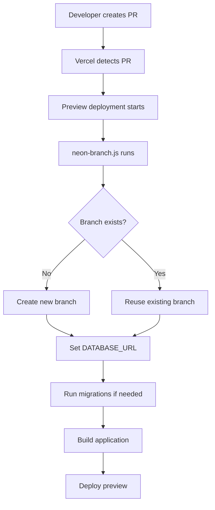

# Neon Database Branching with Vercel Integration

This document explains the automatic database branching setup using Neon and Vercel for preview deployments.

## Overview

When you create a Pull Request, Vercel automatically creates a preview deployment. Our integration ensures that each preview deployment gets its own isolated database branch, preventing conflicts between different features being developed.

## How It Works

### 1. Automatic Branch Creation
- When a PR is created, Vercel triggers a preview deployment
- Our custom script (`.vercel/neon-branch.js`) runs before the build
- A new Neon database branch is created with the name matching the Git branch
- The preview deployment uses this isolated database

### 2. Environment Variables
The system automatically sets these environment variables for preview deployments:
```bash
DATABASE_URL="postgresql://..."           # Points to the PR branch
POSTGRES_URL="postgresql://..."           # Same as DATABASE_URL
POSTGRES_PRISMA_URL="postgresql://..."    # For Prisma if used
NEON_BRANCH_NAME="feature/branch-name"    # The branch name
```

### 3. Branch Lifecycle
- **Creation**: Automatic on first PR deployment
- **Reuse**: Subsequent pushes to the same PR reuse the existing branch
- **Cleanup**: Old branches are cleaned up after 7 days (configurable)

## Configuration

### Required Environment Variables in Vercel
Make sure these are set in your Vercel project settings:

```bash
NEON_PROJECT_ID=your-neon-project-id     # Your Neon project ID
```

You can find your project ID in the Neon console or by running:
```bash
neonctl projects list
```

### Vercel Configuration
The integration is configured in `vercel.json`:
```json
{
  "buildCommand": "node .vercel/neon-branch.js && npm run build",
  "integrations": {
    "neon": [
      {
        "projectId": "$NEON_PROJECT_ID"
      }
    ]
  }
}
```

## Manual Commands

### Create a Branch Manually
```bash
npm run neon:branch
```

### Cleanup Old Branches
```bash
npm run neon:cleanup
```

### Direct neonctl Commands
```bash
# List all branches
npx neonctl branches list --project-id=your-project-id

# Create a branch
npx neonctl branches create --project-id=your-project-id --name=my-feature

# Delete a branch
npx neonctl branches delete branch-id --project-id=your-project-id
```

## Troubleshooting

### Branch Creation Fails
- Check that `NEON_PROJECT_ID` is set correctly
- Ensure you have sufficient permissions in your Neon project
- Check the build logs in Vercel for specific error messages

### Database Connection Issues
- Verify the connection string format is correct
- Check that the branch exists in your Neon project
- Ensure your application code handles database connection errors gracefully

### Build Fails
The integration is designed to be non-blocking. If branch creation fails:
- The build continues with the main database
- A warning is logged but the deployment succeeds
- Check logs to diagnose the issue

## Benefits

1. **Isolation**: Each PR has its own database, preventing data conflicts
2. **Testing**: Safe to test database migrations and schema changes
3. **Parallel Development**: Multiple developers can work on database changes simultaneously
4. **Cost Effective**: Branches are lightweight and automatically cleaned up

## Best Practices

1. **Migration Testing**: Test database migrations in your PR branch before merging
2. **Data Seeding**: Consider seeding test data in preview branches
3. **Branch Naming**: Use descriptive branch names that reflect the feature
4. **Regular Cleanup**: Run cleanup periodically to avoid branch accumulation

## Architecture



This integration provides a seamless development experience with isolated database environments for each feature branch.